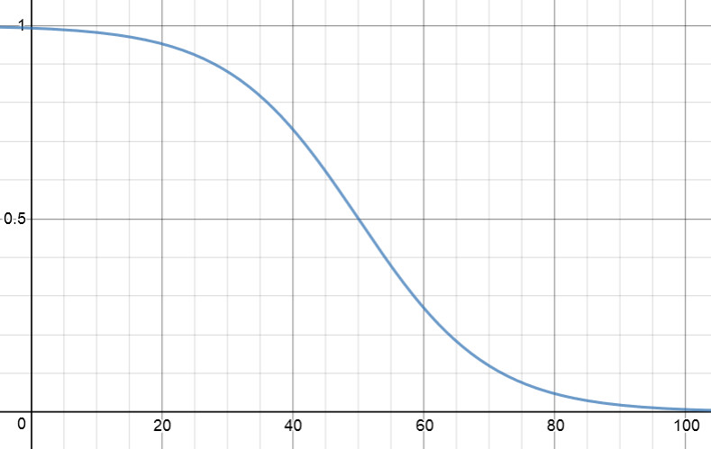
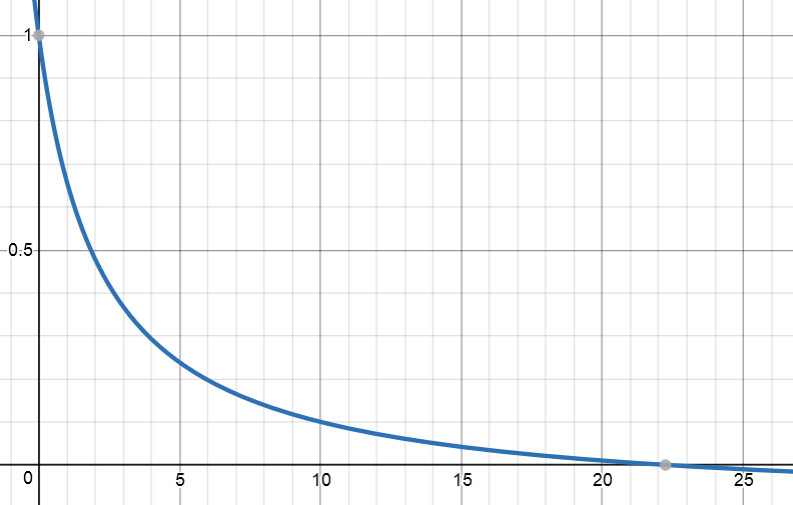

# Project: Path Planning

This project has been prepared by Andre Strobel.

The goal of this project is to program the behavior of a self-driving car during highway traffic. It must avoid accidents, follow traffic rules and also apply comfortable trajectories.

Key aspects like using splines for [Frenet](https://en.wikipedia.org/wiki/Frenet%E2%80%93Serret_formulas) coordinate conversion and the solution for jerk minimizing trajectories follow [Eddie Forson's solution](https://towardsdatascience.com/teaching-cars-to-drive-highway-path-planning-109c49f9f86c).

The following table shows an overview of the most important files:

| File                          | Description                                                                                          |
|-------------------------------|------------------------------------------------------------------------------------------------------|
| README.md                     | This file                                                                                            |
| build.sh                      | Script to build the path planning executable                                                         |
| run.sh                        | Script to run the path planning executable                                                           |
| data/highway_map.csv          | Provided map data inlcuding data for Frenet conversion                                               |
| src/main.cpp                  | Source code of the main function of the particle filter project                                      |
| src/json.hpp                  | Source code for reading and writing [JAVAScript Object Notation](https://en.wikipedia.org/wiki/JSON) |
| src/Map.{h, cpp}              | Source code of the map object                                                                        |
| src/Driver.{h, cpp}           | Source code of the driver object                                                                     |
| src/Vehicle.{h, cpp}          | Source code of the vehicle object                                                                    |
| src/Path.{h, cpp}             | Source code of the path object                                                                       |
| src/Trajectory.{h, cpp}       | Source code of the trajectory object                                                                 |
| src/State.{h, cpp}            | Source code of the state object                                                                      |
| src/spline.{h, cpp}           | Source code of the [spline object](https://kluge.in-chemnitz.de/opensource/spline/)                  |
| src/helper_functions.{h, cpp} | Source code of helper functions for the particle filter                                              |
| out.txt                       | Contains an example debugging output for a full run                                                  |

---

## Content

1. Tool chain setup
    1. Gcc, Cmake, Make and uWebSocketIO
    1. Udacity Simulator
1. Data objects and structures
    1. Map as well as simulator input and output
    1. Driver, Vehicle, Path, Trajectory and State objects
1. Path planning implementation
    1. Program flow
    1. Frenet coordinates
    1. Finite state model
    1. Jerk minimizing trajectories
    1. Cost functions
    1. Debugging environment
1. Execution
    1. Commands to start the simulation
    1. Simulation results
1. Discussion

[//]: # (Image References)

[image1]: ./docu_images/190119_StAn_Udacity_SDCND_PP_Cost_Function_Collision.jpg
[image2]: ./docu_images/190119_StAn_Udacity_SDCND_PP_Cost_Function_Speed.jpg
[image3]: ./docu_images/190119_StAn_Udacity_SDCND_PP_Cost_Function_Travel.jpg

---

## 1. Tool chain setup

### 1. Gcc, Cmake, Make and uWebSocketIO

This project requires the following programs:

* gcc/g++ >= 5.4
  - Linux: gcc / g++ is installed by default on most Linux distros
  - Mac: same deal as make - [install Xcode command line tools](https://developer.apple.com/xcode/features/)
  - Windows: recommend using [MinGW](http://www.mingw.org/)
  
* cmake >= 3.5
  - All OSes: [click here for installation instructions](https://cmake.org/install/)
  
* make >= 4.1 (Linux, Mac), 3.81 (Windows)
  - Linux: make is installed by default on most Linux distros
  - Mac: [install Xcode command line tools to get make](https://developer.apple.com/xcode/features/)
  - Windows: [Click here for installation instructions](http://gnuwin32.sourceforge.net/packages/make.htm)
  
* [uWebSocketIO](https://github.com/uWebSockets/uWebSockets)
  - Works with Linux and Mac systems
  - Windows: Use Docker, VMware or even [Windows 10 Bash on Ubuntu](https://www.howtogeek.com/249966/how-to-install-and-use-the-linux-bash-shell-on-windows-10/) (although I wasn't able to get it working with the latest Ubuntu app in Windows 10)

### 2. Udacity Simulator

The path planning program connects to the [Udacity Simulator](https://github.com/udacity/self-driving-car-sim/releases) version [Term 3 Simulator v1.2](https://github.com/udacity/self-driving-car-sim/releases/tag/T3_v1.2) via [uWebSocketIO](https://github.com/uWebSockets/uWebSockets). The simulator is available for Linux, Mac and Windows.

## 2. Data objects and structures

### 1. Map as well as simulator input and output

The map information is loaded from the file `data/map_data.txt` which has the following structure:

| Column | Description |
|--------|-------------|
| 1      | x position  |
| 2      | y position  |
| 3      | landmark id |

The map object class `Map` is defined in `map.h`. The only content is a vector list `landmark_list` of landmarks `single_landmark_s` with the following data structure:

| Variable | Value or Description   |
|----------|------------------------|
| `id_i`   | landmark id as integer |
| `x_f`    | x position as float    |
| `y_f`    | y position as float    |

### 2. Driver, Vehicle, Path, Trajectory and State objects

The particle filter is defined as object class `ParticleFilter` in `particle_filter.{h, cpp}`. A particle filter instance contains the number of particles in `num_particles`, whether it has been initialized in `is_initialized`, a vector list `weights` containing the weights of all particles as well as a vector list `particles` for all the particles. Each particle is defined as data structure `Particle`:

| Variable       | Value or Description                                                                   |
|----------------|----------------------------------------------------------------------------------------|
| `id`           | particle id as integer                                                                 |
| `x`            | x position as double                                                                   |
| `y`            | y position as double                                                                   |
| `theta`        | heading angle of particle as double                                                    |
| `weight`       | weight showing how good it associates landmarks to the observations as double          |
| `associations` | vector list of landmark ids (integers) associated to the observations                  |
| `sense_x`      | vector list of x positions (double) of the observations added to the particle position |
| `sense_y`      | vector list of y positions (double) of the observations added to the particle position |

## 3. Path planning implementation

### 1. Program flow

Test

### 2. Frenet coordinates

Test

### 3. Finite state model

Test

### 4. Jerk minimizing trajectories

Test

### 5. Cost functions

In this project the prediction step of the particle filter assumes a linear bicycle motion model.

  

### 6. Debugging environment

```C
// predict state with bicycle motion model - handle zero yaw rate separately
if (fabs(yaw_rate) < ZERO_DETECTION) {
	
	// precalculations
	theta_0 = particles[current_particle].theta;
	velocity_dot = velocity * delta_t;
	
	// motion step
	particles[current_particle].x += velocity_dot * cos(theta_0);
	particles[current_particle].y += velocity_dot * sin(theta_0);
	
}
else {
	
	// precalculations
	theta_0 = particles[current_particle].theta;
	velocity_over_yaw_rate = velocity / yaw_rate;
	theta_dot = yaw_rate * delta_t;
	
	// motion step
	particles[current_particle].x += velocity_over_yaw_rate * (sin(theta_0 + theta_dot) - sin(theta_0));
	particles[current_particle].y += velocity_over_yaw_rate * (cos(theta_0) - cos(theta_0 + theta_dot));
	particles[current_particle].theta += theta_dot;
	
}
```

The distance between two points is calculated with the following function:

```C
inline double dist(double x1, double y1, double x2, double y2) {
	return sqrt((x2 - x1) * (x2 - x1) + (y2 - y1) * (y2 - y1));
}
```

The transformation between vehicle coordinates (observations with change/distance relative to the vehicle) and global map coordinates (particles with position as offset and heading angle alpha) is calculated with the following equations:

```C
	// transformations
	x_map = x_offset_map + (cos(alpha) * x_change_relative) - (sin(alpha) * y_change_relative);
	y_map = y_offset_map + (sin(alpha) * x_change_relative) + (cos(alpha) * y_change_relative);
```

The [multi-variate Gaussian distribution](https://en.wikipedia.org/wiki/Multivariate_normal_distribution) is calculated with the following function:

```C
inline double mvg(double x_value, double y_value, double mu_x, double mu_y, double s_x, double s_y) {
	return (1 / (2 * M_PI * s_x * s_y)) * exp(-((pow(x_value - mu_x, 2) / (2 * pow(s_x, 2))) + (pow(y_value - mu_y, 2) / (2 * pow(s_y, 2)))));
}
```

The flow of the particle filter in each step is defined by the following sequence of methods:

```C
ParticleFilter pf;
...
in each step do {
	if (!pf.initialized()) {
		pf.init(...);
	}
	else {
		pf.prediction(...);
	}
	pf.UpdateWeights(...);
	pf.resample(...);
}
```

In the first step the `pf.init()` method initializes all particles with a random distribution around a first estimate for the location. The random noise is added to each particle's location with the method `addNoise()`.

The `pf.prediction()` method uses the above described linear bicycle motion model to calculate the location of all particles after the duration `delta_t`. It also adds random noise to each particle's location with the method `addNoise()`. This ensures that we consider new and potentially better particle locations in each step.

The `pf.UpdateWeights()` method executes a sequence of steps for all particles to update their weights based on the new observations (i.e. measurements). First it determines the map landmarks within the sensor range of the particle's location. Then it uses the above mentioned equations to transform the vehicle observations into global map coordinates for the particle. After this it uses the [nearest neighbor method](https://en.wikipedia.org/wiki/Nearest_neighbor_search) to associate the observations in global map coordinates to the map landmarks within the sensor range. And finally it calculates the new weight for the particle as multiplication of the probabilities that each observation is close to the associated landmark. The [multi-variate Gaussian distribution](https://en.wikipedia.org/wiki/Multivariate_normal_distribution) function from above is used to determine the probability that the observation in global map coordinates is equal to the associated landmark.

The `pf.resample()` method is then used to draw a new list of particles from the existing list of particles. The weight of each particle is used as probability during this drawing process. This ensures that more likely and therefore more accurate particle locations get drawn more often into the new list of particles. The new list of particles contains the same number of particles as before.

### 3. Debugging environment

In order to debug the particle filter efficiently, several methods have been added to display the content of all the input and output variables of each relevant function.

The debug options of the `main()` function are selected with the below parameters. If `bFILEOUTPUT` is `true`, the standard output is redirected into the file `out.txt`. If `bDISPLAY` is `true`, more information about input and output variables is displayed to the standard output. If `bTest` is `true`, a predefined set of inputs is used to run and check the particle filter instead of connecting it to the simulator environment.

```C
const bool bFILEOUTPUT = false;
const bool bDISPLAY = false;
const bool bTEST = false;
```

Inside the particle filter object, all methods can display their input and output variables to the standard output. The parameter `bDISPLAY` must be `true` to enable any of these features. The debugging feature of each particle filter method can be turned on by setting the parameter `bDISPLAY_<name of method>` to `true`. The available method names are listed below.

```C
const bool bDISPLAY = false;
const bool bDISPLAY_init = true;
const bool bDISPLAY_prediction = true;
const bool bDISPLAY_dataAssociation = false;
const bool bDISPLAY_updateWeights = true;
const bool bDISPLAY_resample = true;
const bool bDISPLAY_SetAssociations = false;
const bool bDISPLAY_addNoise = false;
const bool bDISPLAY_getMapLandmark = false;
const bool bDISPLAY_transformVehicle2Map = false;
```

The following methods are used to convert the variable contents into a single string that can be displayed:

```C
std::string createDoubleVectorString(std::vector<double> double_vector);
std::string createIntegerVectorString(std::vector<int> int_vector);
std::string createArrayString(double array[], unsigned int num_elements);
std::string createParticleString(Particle particle);
std::string createParticlesString(std::vector<Particle> particles);
std::string createLandmarkString(LandmarkObs landmark);
std::string createLandmarksString(std::vector<LandmarkObs> landmarks);
std::string createMapString(Map map);
```

## 4. Execution

### 1. Commands to start the simulation

The program is compiled using the `.\build.sh` command. After this it can be started using the `.\run.sh` command. Once the program is running and listening on port 4567 the simulator can be started.

### 2. Simulation results

The vehicle starts very smooth from standstill without violating any of the jerk and acceleration criteria. It also stays below the speed limit at all times. During straight driving the trajectory follows the center of the lane.

 

Passing other vehicles in traffic are the most exciting situations. The driver always picks the fastest lane and uses gaps between vehicles to change lanes and advance.

 

 

The debugging output of this run can be found in [./out.txt](./out.txt).

## 5. Discussion

Connecting to the simulator that executes a varying amount of time steps per iteration can be very challenging at the beginning. It is important to provide a first trajectory that gets the vehicle going. After this the executed number of time steps needs to be carefully subtracted from the intended trajectory. And finally a continuous smooth extension and update of the intended trajectory is key. I implemented an object based framework for the path planning that manages this very well and is easily extendable.

The originally provided [Frenet](https://en.wikipedia.org/wiki/Frenet%E2%80%93Serret_formulas) conversion routines are very poor. They look for the next waypoint and then convert from Frenet to [cartesian coordinates](https://en.wikipedia.org/wiki/Cartesian_coordinate_system) using a linear approach. When applied to full trajectories this can lead to jumps in the cartesian coordinates when switching from one waypoint to the next. You can smoothen the final trajectory in cartesian coordinates, but all previous calculations and validations of the trajectory will not be valid anymore. Therefore, I applied [Eddie Forson's solution](https://towardsdatascience.com/teaching-cars-to-drive-highway-path-planning-109c49f9f86c) to smoothen the conversion from Frenet to carthesian coordinates instead of smoothening the final trajectory.

When the track widens in sharper corners, the simulator sometimes issues an "Outside of lane!" warning when being in the most outer lane. It actually doesn't look like the vehicle left the lane. My assumption is that the detection of the vehicle position inside the simulator is also based on the poor Frenet conversion and therefore issues the warning by mistake.

The parameters are set for a very aggressive driver that looks for small gaps between vehicles to advance as fast as possible. Sometimes the driver gets very close to the vehicle in front before being able to start a lane change to pass it. After starting the lane change, the own vehicle can be faster than the vehicle in front. In this case the cost for collision spikes and the driver immediately makes another lane change further to the side to avoid a collision.


At the end of the track the path planning program terminates with a [core dump](https://en.wikipedia.org/wiki/Core_dump), because several distances and velocities are calculated using longitudinal Frenet coordinates. These switch from the maximal value back to zero which leads to errors.

